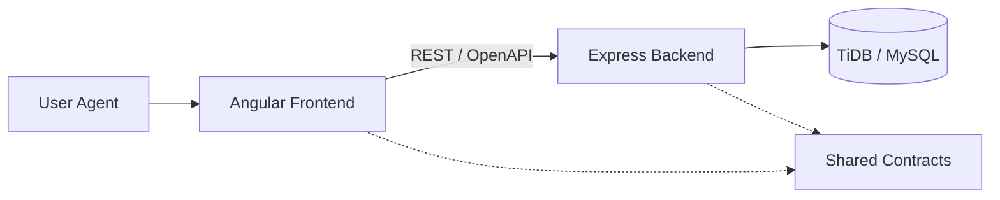

# ZampaStore


Zampastore is a full-stack e-commerce solution architected as an Rx-based Monorepo. The system simulates a real-world, scalable architecture designed for high performance and maintainability, strictly separating Feature, UI, and Data Access layers.

## 🚀 Overview

- **Architecture**: Nx Monorepo with strict module boundaries.
- **Frontend**: Angular 18+ (Standalone Components, Signals), PrimeNG, Tailwind CSS.
- **Backend**: Express.js (Serverless-ready), OpenAPI.
- **Data**: Drizzle ORM, TiDB / MySQL persistence.
- **Security**: HttpOnly Sessions, CSRF Protection, Zod Validation.

## 🏗️ Architecture

The project follows a Domain-Driven Design approach:



### Directory Structure

```text
zampastore/
├── apps/               # Application Entry Points
│   ├── backend/        # API Gateway & Logic
│   └── frontend/       # Angular SPA
├── libs/               # Domain Libraries
│   ├── auth/           # Authentication Domain
│   ├── cart/           # Shopping Cart Domain
│   ├── checkout/       # Order Placement Domain
│   ├── orders/         # Order Management Domain
│   ├── products/       # Catalogue Domain
│   └── ui/             # Shared Design System
└── shared/             # Cross-tier Interfaces (DTOs)
```

## 🛠️ Quick Start

Follow these steps to set up the environment locally.

**1. Install Dependencies**

```bash
npm install
```

**2. Configure Environment**

```bash
cp .env.example .env
```

_Note: Populate `.env` with your database credentials._

**3. Initialize Database**

```bash
npx nx run backend:db-push
```

**4. Start Application**

```bash
npm run start:all
```

## ⚙️ Configuration (.env)

Ensure your `.env` file is configured correctly.

```dotenv
# Application
CLIENT_URL=http://localhost:4200
PORT=3333

# Database (TiDB / MySQL)
TIDB_HOST=127.0.0.1
TIDB_PORT=4000
TIDB_USER=root
TIDB_PASSWORD=password
TIDB_DATABASE=zampastore
TIDB_SSL_MODE=disable
```

## 📜 Commands

**Start All Services**

```bash
npm run start:all
```

**Start Frontend Only**

```bash
npm run frontend:serve
```

**Start Backend Only**

```bash
npm run backend:serve
```

**Run Full Check (Lint, Test, Build)**

```bash
npm run check
```

**Reset Database**

```bash
npx nx run backend:db-reset
```

## 🔗 Endpoints

| Service | URL |
|BC|---|
| **Frontend** | [http://localhost:4200](http://localhost:4200) |
| **API** | [http://localhost:3333/api](http://localhost:3333/api) |
| **Swagger** | [http://localhost:3333/api/docs](http://localhost:3333/api/docs) |

---

**Author**: Agata Di Calogero
_Developed for Master in Full Stack Development - Start2Impact University_
